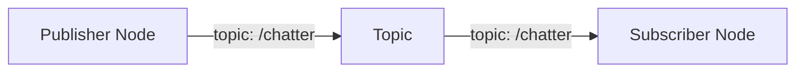

# ADR-004: Visualization Strategy for Technical Diagrams

**Status**: Proposed
**Date**: 2025-12-05
**Feature**: 001-ros2-chapter (spans all 4 modules)
**Context**: The book covers complex technical concepts (ROS 2 architecture, physics simulation, AI perception, autonomous workflows) that benefit from visual explanation. Key decisions:

- How many diagrams per chapter?
- What diagram types (architecture, data flow, state machines, workflow, concept maps)?
- What tools and formats (ASCII, SVG, Mermaid, Figma)?
- How to balance visual richness with Docusaurus build time and maintenance overhead?

## Decision

**Chosen Approach: 4–6 Diagrams per Chapter, Mixed Formats (ASCII + SVG + Mermaid) with Tool-Specific Selection**

### Strategy by Chapter:

**Chapter 1 (ROS 2): 5 Diagrams**
1. ROS 2 Architecture diagram (concepts: nodes, topics, services, actions) — **Mermaid graph**
2. ROS 2 Communication Flow (publisher → topic → subscriber) — **Mermaid sequence diagram**
3. URDF Structure for Humanoid (robot hierarchy: links, joints) — **ASCII tree + SVG visual**
4. Node-to-Node Message Flow (publisher/subscriber example) — **Mermaid flowchart**
5. Launch File Execution Timeline (ROS 2 startup sequence) — **Mermaid timeline or flowchart**

**Chapter 2 (Digital Twin): 5 Diagrams**
1. Physics Simulation Loop (Gazebo cycle: physics → sensors → actuators) — **Mermaid flowchart**
2. URDF-to-SDF Conversion (relationships, differences) — **Mermaid graph**
3. Gazebo + ROS 2 Integration (topics, services, Gazebo plugins) — **Mermaid architecture diagram**
4. ROS 2 Bridge to Unity (middleware, data serialization) — **Mermaid sequence diagram**
5. Humanoid in Gazebo vs. Unity (dual visualization architecture) — **SVG side-by-side comparison**

**Chapter 3 (Isaac): 6 Diagrams**
1. Isaac Ecosystem Architecture (Omniverse → Isaac Sim → Perception Stack) — **Mermaid graph**
2. Synthetic Data Generation Pipeline (domain randomization, camera configurations) — **Mermaid flowchart**
3. Perception Stack Components (VSLAM, stereo depth, object detection stacked) — **Mermaid architecture**
4. Nav2 Planning Architecture (global planner → local planner → controller) — **Mermaid flowchart**
5. RL Training Loop (state → policy → action → reward → next state) — **Mermaid state machine**
6. Sim-to-Real Transfer Concept (simulation → transfer → real robot) — **Mermaid flowchart**

**Chapter 4 (VLA): 6 Diagrams**
1. VLA Paradigm Overview (speech → language → vision → action loop) — **Mermaid graph**
2. Whisper Speech-to-Text Processing (audio → embeddings → text) — **Mermaid flowchart**
3. LLM Task Decomposition (natural language → structured tasks as JSON) — **SVG or ASCII example** (plus JSON block)
4. Vision Model Processing (image → features → object/scene understanding) — **Mermaid flowchart**
5. Action Execution Pipeline (task → ROS 2 action calls → robot motion) — **Mermaid sequence diagram**
6. End-to-End VLA Workflow (all 5 components integrated, feedback loop) — **Mermaid comprehensive flowchart**

### Format Guidelines:

| Diagram Type | Best Format | Tools | Rationale |
|---|---|---|---|
| Architecture overview (boxes + relationships) | Mermaid graph | `graph LR` | Simple, version-controlled, renders in Docusaurus natively |
| Sequence/interaction (actor → message → response) | Mermaid sequence | `sequenceDiagram` | Clear temporal flow, easy to maintain |
| State machines (state → transition) | Mermaid state machine | `stateDiagram` | Precise for workflows, policies, loops |
| Flowcharts (decision diamond, process box) | Mermaid flowchart | `flowchart TD` | Intuitive, widely understood, version-controllable |
| Comparisons (side-by-side, visual richness) | SVG | Figma/Inkscape export | Richer visuals, but maintained externally; reference in docs |
| Code/data structures (trees, hierarchies) | ASCII art or Mermaid graph | `graph TD` or backticks | ASCII is inline-maintainable; Mermaid for complex hierarchies |

### Implementation Detail:

**Mermaid Diagrams (inline in Markdown)**:
```markdown

```
- Rendered automatically by Docusaurus
- Version-controlled in Git
- No external tool required for viewing

**SVG Diagrams (external files)**:
- Store as `docs/assets/diagrams/<chapter>-<num>-<name>.svg`
- Export from Figma or Inkscape
- Embed in Markdown: ``
- Version-controlled, but externally designed

**ASCII Diagrams (inline)**:
- For simple tree structures, timelines, or data layout
- Inline in code blocks (triple backticks, no language tag)
- Useful for URDF hierarchy, launch file dependencies

### Diagram Frequency & Placement:

- **Chapter Introduction**: 1 diagram (high-level concept preview)
- **Section 1–3 (Main Content)**: 2–3 diagrams (concept explanation, workflow, data flow)
- **Chapter Summary/Conclusion**: 1 diagram (integration or "what's next")
- **All diagrams**: Captioned with brief explanation (2–3 sentences)

### Accessibility Requirements:

- All diagrams include `alt` text for screen readers
- Mermaid diagrams: `alt="[Description of diagram]"` in Markdown alt tag
- SVG diagrams: ``
- Text descriptions provided for complex diagrams in chapter text

## Consequences

### Positive

- **Beginner-friendly**: Visual explanations supplement text; complex concepts become clearer
- **Consistent narrative flow**: Diagrams reinforce chapter progression and learning objectives
- **Maintainability**: Mermaid diagrams are version-controlled and inline; no separate graphics editor needed
- **Build simplicity**: Docusaurus builds Mermaid natively; no additional processing required
- **Accessibility**: Structured diagrams (Mermaid) render in all environments; SVG fallback for richness
- **Engagement**: Mixed formats (not all text, not all static images) keep readers engaged across 4 chapters
- **Reusability**: Mermaid diagrams can be copied into presentations, blogs, or supplementary materials

### Negative

- **Diagram maintenance**: As concepts evolve, diagrams must be updated (mitigated by version control)
- **Design time**: Creating 20+ diagrams across 4 chapters requires effort; SVG diagrams need external tool setup
- **Mermaid limitations**: Complex custom visuals may not render perfectly (mitigated by SVG fallback for rich diagrams)
- **Learning curve**: Contributors must learn Mermaid syntax (mitigated by examples and templates)
- **Visual consistency**: Mixed tools (Mermaid + SVG) may require design guidelines to maintain consistency

### Risks

- **Diagram rendering failures**: Mermaid version incompatibility or complex diagrams fail to render (mitigated by fallback PNG screenshots in Docusaurus build)
- **Build time**: Many complex Mermaid diagrams could slow Docusaurus build (mitigated by pre-rendering or splitting chapters)
- **Accessibility gaps**: Alt text inadequate or missing for complex diagrams (mitigated by content review checklist)

## Alternatives Considered

### Alternative 1: No Diagrams (Pure Text)
- **Approach**: Chapters rely entirely on text explanations; no visual aids
- **Pros**: Minimal maintenance, fast build, no design overhead, version-control trivial
- **Cons**: Robotics and AI are inherently visual; text alone is insufficient for beginner understanding; diagrams are expected in technical books
- **Rejected because**: Core learning objectives require visual explanation (e.g., ROS 2 node topology, sim-to-real pipeline); losing diagrams compromises pedagogical effectiveness

### Alternative 2: Excessive Diagrams (10+ per chapter)
- **Approach**: Every concept gets its own diagram; heavy visual emphasis
- **Pros**: Highly visual, reduces text reading, may improve engagement
- **Cons**: Maintenance burden explodes; build time increases; cognitive overload if too many; readers lose focus; diagrams compete with narrative
- **Rejected because**: 40–50 diagrams across 4 chapters is unsustainable; violates beginner-friendly principle (too much information); plan specifies 4–6 per chapter as optimal

### Alternative 3: All Diagrams as External SVG/PNG Files
- **Approach**: Every diagram designed in Figma/Adobe; stored as separate files; no inline Mermaid
- **Pros**: Maximum visual control, rich designs, professional appearance
- **Cons**: Heavy maintenance (external tool required for updates), build complexity (image optimization), slower rendering, not version-controlled in source (Figma/Adobe projects must be managed separately), no quick iteration
- **Rejected because**: Overkill for educational content; Mermaid provides 80% of value with 20% effort; inline Markdown diagrams enable rapid iteration and community contributions

### Alternative 4: Single Tool Only (All Mermaid)
- **Approach**: Use Mermaid for all diagrams; no SVG, no ASCII
- **Pros**: Consistent, simple maintenance, all inline, no external tooling needed
- **Cons**: Some diagrams (comparisons, rich layouts) don't render well in Mermaid; limited customization for visual richness; may feel repetitive
- **Rejected because**: Mixed formats enable best-fit tool selection; Mermaid excels at flowcharts/graphs but SVG is necessary for side-by-side comparisons and visual richness

### Alternative 5: Embedded Interactive Diagrams (D3.js, Three.js)
- **Approach**: Use JavaScript libraries for interactive, animated diagrams (e.g., 3D robot visualization, interactive state machines)
- **Pros**: Highly engaging, readers can interact (rotate, zoom, play animations), modern feel
- **Cons**: Significant development overhead, steep learning curve for contributors, JavaScript bundle size increases, slower rendering, accessibility challenges (interactive diagrams may not work with screen readers)
- **Rejected because**: Scope creep; exceeds beginner-friendly principle; maintenance burden is untenable for a 4-chapter book

## Implementation Plan

1. **Phase 1 (Weeks 1–2): Diagram Design & Templates**
   - Audit plan.md to identify all 22 diagrams (4–6 per chapter)
   - Create Mermaid template library (common patterns: architecture, flowchart, sequence, state machine)
   - Set up Figma project for SVG diagrams (or Inkscape + Git repository)
   - Define style guide (colors, fonts, line widths, icon conventions)

2. **Phase 2 (Weeks 2–3): Chapter 1–2 Diagrams**
   - Draft all 5 diagrams for Chapter 1 (ROS 2) in Mermaid
   - Draft all 5 diagrams for Chapter 2 (Digital Twin) in mix of Mermaid and SVG
   - Test Docusaurus rendering: `npm run build` → verify diagrams render correctly
   - Create alt text for each diagram

3. **Phase 3 (Weeks 3–4): Chapter 3–4 Diagrams**
   - Draft all 6 diagrams for Chapter 3 (Isaac)
   - Draft all 6 diagrams for Chapter 4 (VLA)
   - Test build and rendering

4. **Phase 4 (Week 4): Accessibility & Maintenance**
   - Audit alt text for screen reader compliance
   - Test with WAVE or axe DevTools
   - Create contributor guidelines for diagram updates
   - Document Mermaid syntax examples for future contributors

5. **Phase 5 (Week 5): Polish & Integration**
   - Integrate all diagrams into chapters
   - Verify captions and in-text references
   - Final build and GitHub Pages deployment

## Validation Criteria

- ✅ All 22 diagrams (5+5+6+6) created and integrated into respective chapters
- ✅ Mermaid diagrams render without errors in Docusaurus build
- ✅ SVG diagrams embed correctly and are optimized for web (<50 KB each)
- ✅ Every diagram has descriptive alt text (minimum 20 characters)
- ✅ Diagram captions are clear and reference chapter concepts
- ✅ Accessibility test passes (WAVE, axe DevTools, or manual screen reader check)
- ✅ Build time remains under 30 seconds (including diagram rendering)
- ✅ Contributor guide includes examples for adding/updating diagrams

## References

- **Plan**: `specs/001-ros2-chapter/plan.md` (PART 6.4: Visualization Strategy)
- **Module 1 Spec**: `specs/001-ros2-chapter/spec.md` (FR-004: "provide accurate diagrams for ROS 2 communication...")
- **Module 2 Spec**: `specs/002-digital-twin/spec.md` (FR-005: "provide architecture diagram...")
- **Module 3 Spec**: `specs/003-isaac-perception/spec.md` (FR-006: "explain Isaac ecosystem with diagrams...")
- **Module 4 Spec**: `specs/004-vla-humanoid/spec.md` (FR-007: "provide end-to-end workflow diagram...")
- **Related ADRs**: ADR-001 (Docusaurus, MDX support), ADR-002 (Code examples strategy)
- **Mermaid Docs**: https://mermaid.js.org/
- **Docusaurus MDX**: https://docusaurus.io/docs/markdown-features/mermaid
